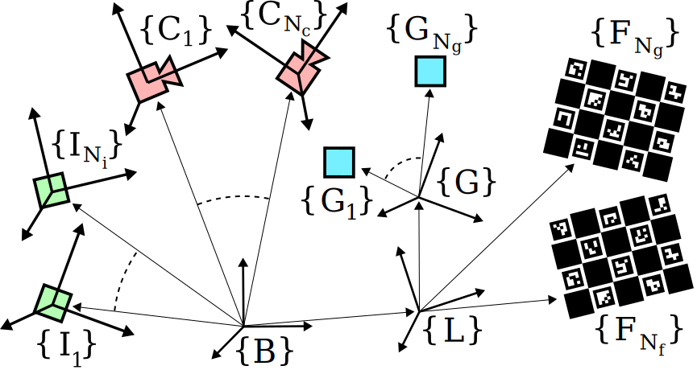

# ekf_cal
[](https://github.com/unmannedlab/ekf_cal/actions/workflows/documentation.yaml)

Extended Kalman Filter Calibration and Localization: ekf_cal is a package focused on the simulation and development of a multi-sensor online calibration kalman filter. It combines the architecture of a Multi-State Constraint Kalman Filter (MSCKF) with a multi-sensor calibration filter to provide intrinsic and extrinsic estimates for the following sensors:
- [IMU](https://unmannedlab.org/ekf_cal/imu.html)
- [GPS](https://unmannedlab.org/ekf_cal/gps.html)
- [Cameras](https://unmannedlab.org/ekf_cal/camera.html)
- [Fiducials](https://unmannedlab.org/ekf_cal/fiducial.html)



## Quick Start

### Clone the Repository

This guide assumes you have the `ekf_cal` repository in a colcon workspace.
```
mkdir ekf_cal_ws/
mkdir ekf_cal_ws/src/
cd ekf_cal_ws/src/
git clone git@github.com:unmannedlab/ekf_cal.git
cd ../
```

### Dependencies
The ekf_cal package has the following hard dependencies that are required for all compilations:
- [OpenCV](https://opencv.org/)
- [Eigen 3](https://eigen.tuxfamily.org/index.php?title=Main_Page)

The following dependencies are for building the ROS node and simulation, respectively
- [ROS2](https://docs.ros.org/en/rolling/index.html)
- [yaml-cpp](https://github.com/jbeder/yaml-cpp)

The following soft dependencies useful for development and documentation
- [Doxygen](https://www.doxygen.nl/index.html)
- [Google Test](https://google.github.io/googletest/)

These can be installed by running [rosdep](https://wiki.ros.org/rosdep) in the base directory of the colcon workspace (e.g. `ekf_cal_ws`)
```
rosdep install --from-paths src -y --ignore-src
```

### Build

Building can be done simply with the following command:

```
colcon build --symlink-install --packages-select ekf_cal --event-handlers console_cohesion+ --cmake-args -DCMAKE_C_FLAGS='--coverage' -DCMAKE_CXX_FLAGS='--coverage'
```

#### Docker
Alternatively, a Dockerfile is provided, which can be used either inside a VS Code [devcontainer](https://code.visualstudio.com/docs/devcontainers/containers), or a standalone container.

### Input Files

This repository offers two main ways to utilize the Kalman filter framework: a simulation and ROS2 node. Both the simulation and ROS node are configurable and runnable using identically formatted YAML files. Further documentation can be found on the [Parameters](https://unmannedlab.org/ekf_cal/parameters.html) page.

### Simulation

Simulations can be run using a YAML configuration file that extends the base configuration file with additional parameters. See the example [example.yaml](config/example.yaml). Multiple simulations can be run in parallel using the [run.py](eval/run.py). An example using a single input is given below

```
python3 eval/run.py config/example.yaml
```

The results of a run can be plotted using [report.py](eval/report.py)
```
python3 eval/report.py config/example.yaml
```

To run and plot in sequence, utilize [evaluate.py](eval/evaluate.py)
```
python3 eval/evaluate.py config/example.yaml
```

This will generate and run the requested number of simulation runs for the specified run time and 
produce plots of the Monte Carlo data. 

### Launch ROS2 Node

For an example of a filter node launch file, see [example.launch.py](launch/example.launch.py)

In particular, note the configuration file [example.yaml](config/example.yaml).

The configuration file specifies which sensor topics should to use and the initialization values. Once built, the ROS node can be started by running the following command

```
ros2 launch example.launch
```

## Testing & Static Analysis

Once the package has been built, unit tests and static analysis can be run with the following commands
```
colcon test --packages-select ekf_cal --event-handlers console_direct+
```

A test code coverage report can be generated using the following commands
``` 
colcon build --symlink-install --packages-select ekf_cal \
   --event-handlers console_cohesion+ \
   --cmake-args -DCMAKE_C_FLAGS='--coverage' -DCMAKE_CXX_FLAGS='--coverage'

colcon test --packages-select ekf_cal --pytest-with-coverage \ 
   --pytest-args --cov-report=term --event-handlers console_direct+

colcon lcov-result --packages-select ekf_cal --filter '*_test.cpp' '*_main.cpp'
```

The lines of code in the repository can be counted ([cloc](https://github.com/AlDanial/cloc)) using the following command

```
echo 'Count Lines of Code {#cloc}\n============' > docs/software/cloc.md && \
cloc src eval --md | tail -n +4 >> docs/software/cloc.md && \
sed -i 's/--------|--------|--------|--------|--------/| | | | | |/' docs/software/cloc.md
```

A performance [flamegraph](https://github.com/brendangregg/FlameGraph) can be generated using the following command

```
cd docs/flamegraph/ && ./run_perf.sh
```

## Documentation

Documentation can be generated using the following command:
```
doxygen .doxyfile
```

<!-- @TODO: The \prescript macro causes conflicts with this command -->
A single pdf can be generated of the documentation using the following command
```
doxygen .doxyfile && cd docs/doxygen/latex && make
```

## References

```bibtex
@inproceedings{2023_Multi_IMU,
  title         = {Online Multi-IMU Calibration Using Visual-Inertial Odometry},
  booktitle     = {2023 IEEE International Conference on Multisensor Fusion and Integration for Intelligent Systems (MFI)},
  author        = {Jacob Hartzer and Srikanth Saripalli},
  year          = {2023},
  doi           = {10.1109/SDF-MFI59545.2023.10361310},
  arxiv         = {2310.12411},
}
```
```bibtex
@inproceedings{2022_Multi_Cam,
  title     = {Online Multi Camera-IMU Calibration},
  booktitle = {2022 IEEE International Symposium on Safety, Security, and Rescue Robotics (SSRR)},
  author    = {Hartzer, Jacob and Saripalli, Srikanth},
  year      = {2022},
  pages     = {360-365},
  doi       = {10.1109/SSRR56537.2022.10018692},
  arxiv     = {2209.13821},
}
```
