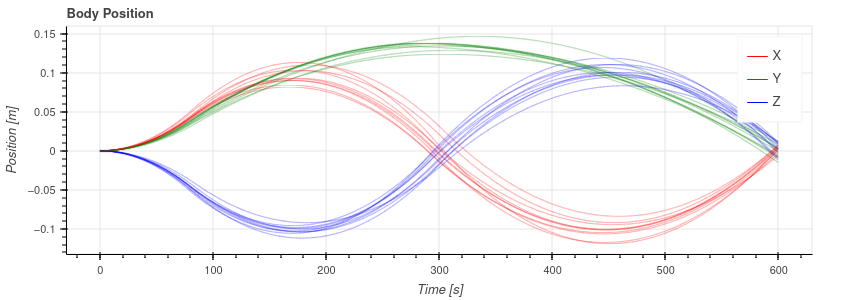
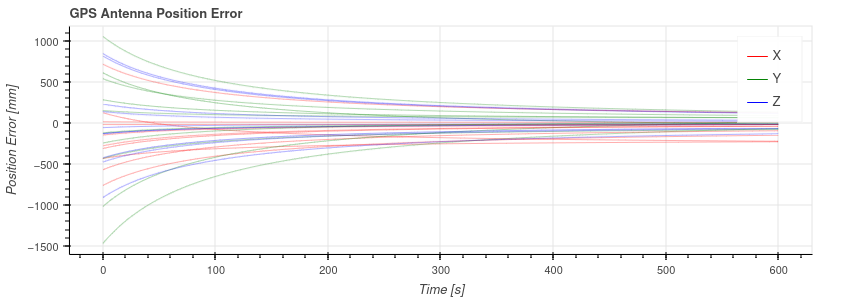

# Summary

Navigation is key to the success of operating any mobile autonomous system. Modern autonomous systems use multiple types of sensors to handle a wide variety of environments. To improve system robustness in these challenging environments, redundant sensors are often used to protect against erroneous sensor measurements or outright sensor failures. However, the underlying navigation system must be designed in such a way as to handle these duplicate measurement streams and the addition of each sensor introduces parameters that must be properly calibrated before these sensors' measurements can be effectively used. Moreover, these underlying calibration parameters can change, and often must be estimated *online*. Kalman filters are a common and near-optimal method to estimate a system's state given a series of measurements and transitions through time. However, with improper tunings, these filters can be unstable and produce very undesirable estimates. As such, it is important to verify a filters performance and stability across a large set of runs in the desired operating environment with various initial errors in state estimates.

This software package, `ekf_cal`, seeks to provide a framework for testing mutli-sensor Kalman filters using Monte Carlo techniques. By running a given sensor configuration through a large sample of runs, each with varying initial conditions and errors, stability can be verified. By looking and the resulting error distributions in any of the system states, biases can be eliminated and the expected system error can be estimated. In addition to the simulation running framework, additional scripts are provided that calculate the distribution of errors for a Monte Carlo and generate a report is showing state values and errors across the run to aid in analysis.

Additionally, this software package provides example implementations of state-of-the-art Kalman filter-based calibration routines and is currently being using for ongoing research [@2022_Multi_Cam] and [@2023_Multi_IMU].

# Statement of need

Currently, there are not many software packages for prototyping and evaluating Kalman Filter-based calibration and localization algorithms. The most popular, which also includes a simulation architecture, is Open-VINS [@Geneva2020ICRA], which makes use of interpolated B-splines to define true motion data. Inertial measurements are sampled from the second derivative of the spline path, and bearing camera measurements are generated using global fixed features which are projected onto the camera sensor frame. The primary limitation of Open-VINS, and the inspiration for this work, is the limited types of sensors available and the constraint to a single IMU for filtering.

There exist other batch-based calibration packages, such as the Matlab Camera Calibration Toolbox [@matlab-cam-calib] for mono and stereo camera setups, where the primary limitations are the limited sensor types and closed-source codebase. Additionally, there are batch-based optimizers such as Kalibr [@Rehder] or OpenCalib [@opencalib] that provide tools for performing calibration of multi-sensor systems, but do not provide these calibrations online. These software applications are therefore susceptible to changing calibration parameters, such as drifts or shifts in mounting.

The `ekf-cal` package, in contrast, seeks to provide additional avenues for testing Kalman filter based calibration and localization techniques while supporting multi-IMU filtering, GNSS sensors, and fiducial markers. Similar to existing work, this is all done on top of a B-spline based truth model and global feature points.

In summary, this package

- Provides examples of the filtering techniques outlined in [@2022_Multi_Cam] and [@2023_Multi_IMU], which reference this work
- Provides a Monte Carlo architecture for testing filter-based calibration techniques
- Provides analysis tools for plotting results and evaluating performance statistics

# Capabilities
`ekf_cal` supports any number or combination of the sensors listed in the following sections. Errors in sensor measurements and calibrations are varied across Monte Carlo runs, which allow for more robust testing of calibration and localization algorithms. The key parameters supported by all sensors are

| Sensor Parameter | Description |
| --- | --- |
| `name`             | Sensor name |
| `topic`            | ROS topic to subscribe to |
| `rate`             | Update rate |
| `data_logging_on`  | Flag to enable data logging |
| `data_log_rate`    | Data logging rate |
| `output_directory` | Data logging output directory |

### IMU
`ekf_cal` supports the use of multiple IMU for updating the state estimate of acceleration and angular rates. A single IMU can be selected to provide state predictions, or all IMU can be used to provide state updates within an Extended Kalman Filter framework. The key IMU parameters supported are

| IMU Parameter | Description |
| --- | --- |
| `is_extrinsic`       | Flag to enable extrinsic calibration |
| `is_intrinsic`       | Flag to enable intrinsic calibration |
| `pos_i_in_b`         | Position offset vector |
| `ang_i_to_b`         | Angular offset quaternion |
| `acc_bias`           | Accelerometer bias vector |
| `omg_bias`           | Gyroscope bias vector |
| `pos_stability`      | Position stability |
| `ang_stability`      | Angular stability |
| `acc_bias_stability` | Accelerometer bias stability |
| `omg_bias_stability` | Gyroscope bias stability |
| `use_for_prediction` | Flag to use measurements for prediction |
| `variance`           | Initial state variance |

### Cameras
`ekf_cal` supports the use of multiple camera that can simultaneously use MSCKF-based feature tracking and/or fiducial marker tracking for state updates. The package is designed to support the use of any OpenCV feature tracker, descriptor, or matcher for MSKCF-based visual inertial odometry. For fiducial measurements, the package supports the use of Aruco or Charuco grid boards. The key camera parameters supported are

| Camera Parameter | Description |
| --- | --- |
| `pos_c_in_b`    | Camera initial position offset |
| `ang_c_to_b`    | Camera initial angular offset |
| `pos_stability` | Position stability |
| `ang_stability` | Angular stability |
| `variance`      | Initial state variance |
| `tracker`       | Tracker name |
| `fiducial`      | Fiducial name |
| `intrinsics`    | Camera intrinsics |

### GPS
`ekf_cal` supports the use of multiple GPS antenna for updating the state estimate of position in the global frame. The currently implemented filter can utilize these measurements to estimate the initial global to local frame transformation as well as provide online estimates of the heading of the local frame. The key GPS parameters supported are

| GPS Parameter | Description |
| --- | --- |
| `pos_a_in_b`    | GPS antenna position offset vector |
| `pos_l_in_g`    | Local LLA position in global |
| `ang_l_to_g`    | Local angle to global |
| `variance`      | Initial state variance |
| `is_extrinsic`  | Flag to enable extrinsic calibration |
| `pos_stability` | Position stability |

### Plotting and Analysis
Other package features are the Monte Carlo report generation and statistical summary functions that simplify the analysis of algorithm changes and development.

# References
