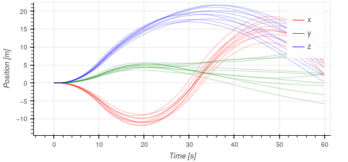

 
# Summary

Navigation is key to the success of operating any mobile autonomous system. Modern autonomous systems use multiple types of sensors to handle a wide variety of environments. To improve system robustness in these challenging environments, redundant sensors are often used to protect against erroneous sensor measurements or outright sensor failures. However, the underlying navigation system must be designed in such a way as to handle these duplicate measurement streams and the addition of each sensor introduces parameters that must be properly calibrated before these sensors' measurements can be effectively used. Moreover, these underlying calibration parameters can change, and often must be estimated *online*. Kalman filters are a common and near-optimal method to estimate a system's state given a series of measurements and transitions through time. However, with improper tunings, these filters can be unstable and produce very undesirable estimates. As such, it is important to verify a filters performance and stability across a large set of runs in the desired operating environment with various initial errors in state estimates.

This software package, `ekf_cal`, seeks to provide a framework for testing mutli-sensor Kalman filters using Monte Carlo techniques. By running a given sensor configuration through a large sample of runs, each with varying initial conditions and errors, stability can be verified. By looking and the resulting error distributions in any of the system states, biases can be eliminated and the expected system error can be estimated. In addition to the simulation running framework, additional scripts are provided that calculate the distribution of errors for a Monte Carlo and generate a report is showing state values and errors across the run to aid in analysis.

Additionally, this software package provides example implementations of state-of-the-art Kalman filter-based calibration routines and is currently being using for ongoing research [@2022-SSRR,@2023-MFI].

# Statement of need

This package does the following
- Provides examples of the filtering techniques outlined in [@2022-SSRR,@2023-MFI]
- Provides a Monte Carlo simulation for filter-based calibration techniques
- Provides plotting and evaluation statistics

Has so far been utilized in:
- [@2022_Multi_Cam]
- [@2023_Multi_IMU]

Existing Work:
- [@Geneva2020ICRA]
- [@Rehder]

# Capabilities
`ekf_cal` supports any number or combination of the sensors listed in the following sections. Additionally, errors in the calibrations are modelled across Monte Carlo simulations.

## IMU
`ekf_cal` supports the use of multiple IMU for updating the state estimate of acceleration and angular rates. A single IMU can be selected to provide state predictions, or all IMU can be used to provide state updates within an Extended Kalman Filter framework.

## Cameras
`ekf_cal` supports the use of multiple camera that can simultaneously use MSCKF-based feature tracking and/or fiducial marker tracking for state updates. The package is designed to support the use of any OpenCV feature tracker, descriptor, or matcher for MSKCF-based visual inertial odometry. For fiducial measurements, the package supports the use of Aruco or Charuco grid boards.

## GPS
`ekf_cal` supports the use of multiple GPS antenna for updating the state estimate of position in the global frame. The currently implemented filter can utilize these measurements to estimate the initial global to local frame transformation as well as provide online estimates of the heading of the local frame.

## Plotting and Analysis
Other package features are the Monte Carlo report generation and statistical summary functions that simplify the analysis of algorithm changes and development. 

# References